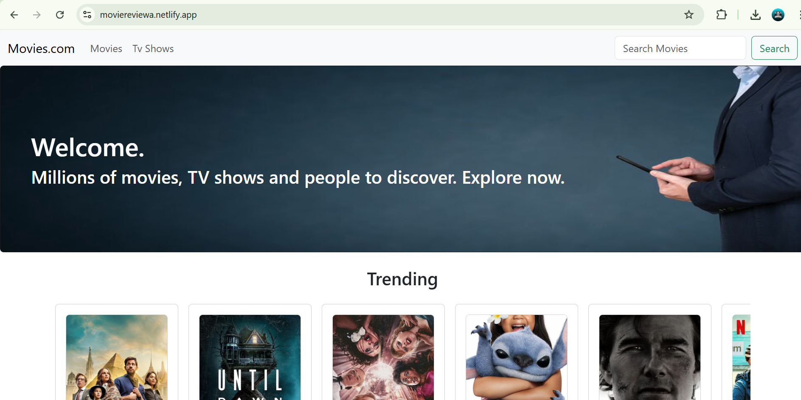

# 🎬 Movie Review App


A responsive movie review application built using **React.js** and **Bootstrap**. This project uses the TMDB API to fetch movie data and display popular films, search results, detailed info pages, and more — perfect for showcasing React skills in a real-world project.

> 🌐 **Live Demo**: [https://moviereviewa.netlify.app/](https://moviereviewa.netlify.app/)

---

## 📸 Preview

 <!-- Add your screenshot image in a folder called 'screenshots' -->

---
- **TMDB API** – Fetching movie data (Requires TMDB API Key)

## 🚀 Features

- 🔍 **Search Functionality** – Search movies by title
- 🎥 **Popular Movies Listing** – See trending movies with posters and ratings
- 📄 **Movie Details Page** – Overview, release date, ratings, and more
 - 🧩 **Routing** – Using `react-router-dom` for navigating between pages
- 📱 **Responsive UI** – Fully mobile-friendly


---

## 🛠️ Tech Stack

- **React.js** – Component-based frontend framework
- **Bootstrap 5** – Responsive and styled UI components
- **JavaScript (ES6)** – Logic and data handling
- **TMDB API** – Fetching movie data
- **React Router DOM** – Client-side routing

---

## 📁 Folder Structure (Simplified)

movie-review-app/
├── public/
│ └── index.html
├── src/
│ ├── components/
│ │ ├── Navbar.jsx
│ │ ├── MovieCard.jsx
│ │ └── MovieDetails.jsx
│ ├── pages/
│ │ ├── Home.jsx
│ │ └── Search.jsx
│ ├── App.js
│ ├── index.js
│ └── api.js
├── .env
├── package.json
└── README.md


---

## 🔧 How to Run Locally

```bash
1. Clone the repo
2. Run `npm install` to install dependencies
3. Create a `.env` file and add your TMDB API key:
   REACT_APP_TMDB_KEY=your_api_key_here
4. Run `npm start` to launch the app


👤 Author
Ayush
Frontend Developer | React Enthusiast | Computer Engineering Fresher

🌐 Contact
✉️ Email: ayushkumbhalkar68@gmail.com

🔗 LinkedIn: https://www.linkedin.com/in/ayush-kumbhalkar-440403296

🐙 GitHub: https://github.com/FrontendwithAyush 

📦 Hosting
Deployed on Netlify – https://moviereviewa.netlify.app/

